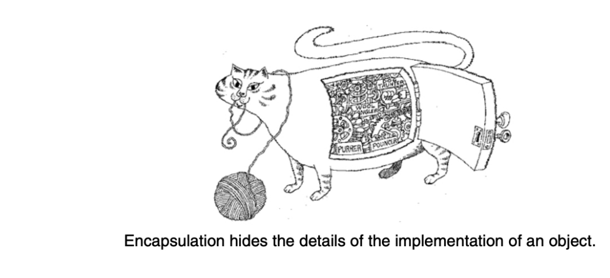
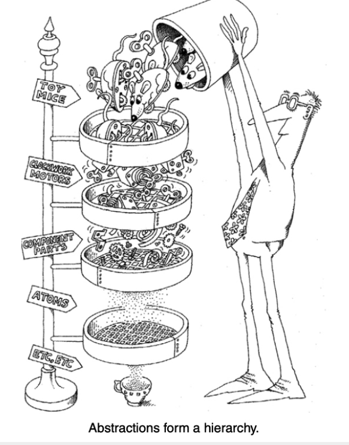

<!-- Encapsulation -->

Data Encapsulation is a fundamental concept in object-oriented programming (OOP) that refers to the bundling of data and methods that operate on that data into a single unit, usually a class. Encapsulation helps in hiding the internal state of an object and only exposing a controlled interface to interact with the object's data. This mechanism ensures that the object's internal representation is hidden from the outside world and can only be accessed or modified through well-defined methods.

It is a major pillar of oops.

<!-- Definition: -->
Binding of data( data member ) and code( member function ) together is called as
encapsulation.

Implementation of abstraction is called as encapsulation.

Abstraction focuses on the observable behavior of an object, whereas encapsulation focuses on the implementation that gives rise to this behavior.

<!-- Image -->

<!-- Main goal of encapsulation is to hide the data. -->

Process of declaraing data member private is called as data hiding.

Data hiding is also called as data encapsulation.

<!-- Setter & Getter Methods -->
Setter and Getter methods are used to control access to private data members of a class.

Getter Method: A method that retrieves or returns the value of a private attribute.
Setter Method: A method that sets or updates the value of a private attribute.Setter & Getter Methods
Setter and Getter methods are used to control access to private data members of a class.

Getter Method: A method that retrieves or returns the value of a private attribute.
Setter Method: A method that sets or updates the value of a private attribute.