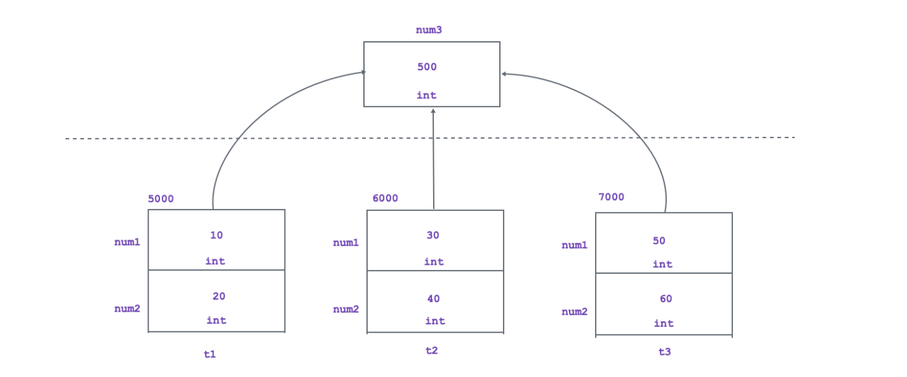
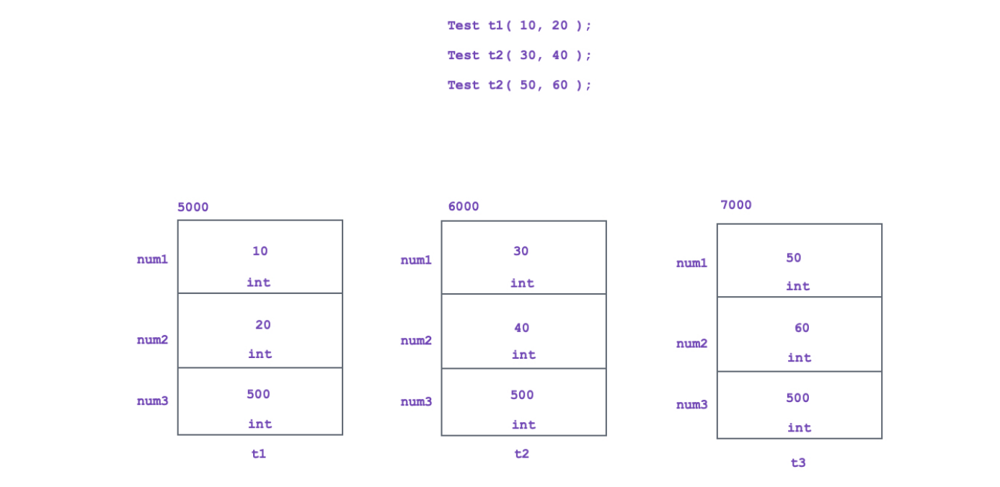

If we want to share value of any data member in all the objects of same class then we should declare data member static.

<!-- Image:  -->

Static data member get space during program loading once per class on data segment.

if we create object of the class then only non static data member get space inside it. Hence size of object depends on size of all the data members declared inside class.

Data member of the class which get space inside object is called as instance variable. In other words non static member is also called as instance variable.

Instance variable get space once per object.

To access instance variable either we should use object to that object.

Data member of the class which do not get space inside object is called as class level variable. In other words static member is also called as class level variable.

Class level variable get space once per class.

To access class level variable we should class name and :: operator.