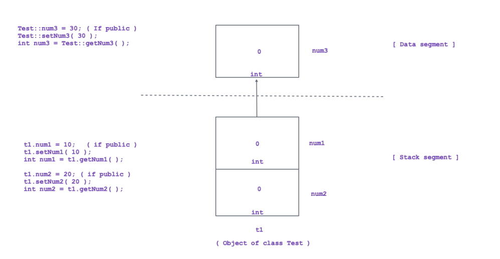

<!-- Image -->

To access non static members of the class, we should define non static member function inside class.

Non static member functions are designed to call on object. Hence it is also called as instace method.

Since non static member functions / instance methods are designed to call on object/instance, it gets this pointer. Since non static member function get this pointer, we can access static as well as non static members inside non static member function.

To access static member of the class, we should define static member function inside class.

Static member functions are designed to call on class name. Hence it is also called as class level method.

Since static member functions / class level methods are designed to call on class name, it doesn't get this pointer. Since static member function doesn't get this pointer, we can access only static members inside static member function.

Static member function do not get this pointer but we can create object inside static member function.

Using object, we can access non static members inside static member function.
